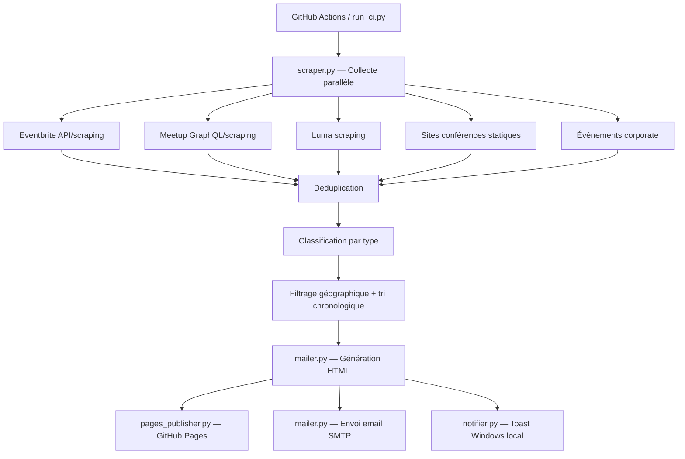

# Document de Conception — Revue des Événements IA en France

## Vue d'ensemble

Ce système est un pipeline automatisé de veille événementielle IA en France, calqué sur l'architecture du projet existant `revue_de_presse_IA`. Il collecte quotidiennement les événements liés à l'intelligence artificielle depuis plusieurs sources web (Eventbrite, Meetup, Luma, sites de conférences, événements corporate), les déduplique, les classe par type, puis génère un rapport HTML interactif dark-theme publié sur GitHub Pages et envoyé par email.

Le pipeline s'exécute via GitHub Actions (cron lundi-vendredi 06h30 UTC) et peut être lancé manuellement en local via `python run_ci.py`.

### Décisions architecturales clés

1. **Même structure modulaire** que `revue_de_presse_IA` : `scraper.py`, `mailer.py`, `config.py`, `run_ci.py`, `pages_publisher.py`, `notifier.py`
2. **Scraping HTTP + parsing HTML/JSON** plutôt qu'APIs officielles payantes — les APIs Eventbrite et Meetup GraphQL sont utilisées quand disponibles gratuitement, sinon fallback sur scraping HTML
3. **Classification par mots-clés** dans le nom et la description de l'événement pour déterminer le type (salon, conférence, meetup, atelier, corporate, webinaire)
4. **Déduplication en deux passes** : par URL d'inscription, puis par combinaison nom normalisé + date + ville
5. **Filtrage géographique** avec villes prioritaires (Paris, Marseille, Aix-en-Provence, Cannes, Toulon) affichées en premier
6. **Dépendances minimales** : `requests` + `python-dotenv` uniquement (comme le projet existant)

## Architecture

### Diagramme de flux



### Structure des fichiers

```
revue_evenement_IA/
├── scraper.py
├── mailer.py
├── config.py
├── run_ci.py
├── pages_publisher.py
├── notifier.py
├── requirements.txt
├── .env.example
├── .gitignore
├── README.md
└── .github/
    └── workflows/
        └── revue-evenement-ia.yml
```

## Composants et Interfaces

### 1. `config.py` — Configuration

```python
SMTP_HOST: str          # Défaut: "smtp.gmail.com"
SMTP_PORT: int          # Défaut: 587
SMTP_USER: str
SMTP_PASSWORD: str
MAIL_TO: str
GITHUB_TOKEN: str
GITHUB_REPOSITORY: str
PRIORITY_CITIES: list[str] = ["PARIS", "MARSEILLE", "AIX-EN-PROVENCE", "CANNES", "TOULON"]
```

### 2. `scraper.py` — Collecteur multi-sources

```python
def collect_events() -> list[dict]: ...
def fetch_eventbrite(query: str, max_items: int = 20) -> list[dict]: ...
def fetch_meetup(max_items: int = 20) -> list[dict]: ...
def fetch_luma(max_items: int = 15) -> list[dict]: ...
def fetch_conferences() -> list[dict]: ...
def fetch_corporate_events() -> list[dict]: ...
def detect_event_type(name: str, description: str, source: str) -> str: ...
def deduplicate(events: list[dict]) -> list[dict]: ...
def normalize_city(city: str) -> str: ...
def normalize_date(date_str: str) -> str: ...
```

### 3. `mailer.py` — Générateur HTML + Email

```python
def build_html(events: list[dict], pages_url: str = "") -> str: ...
def build_email_html(events: list[dict], pages_url: str = "") -> tuple[str, int]: ...
def send_email(events: list[dict], pages_url: str = "") -> bool: ...
```

### 4. `pages_publisher.py` — Publication GitHub Pages

```python
def publish_to_pages(html_content: str, event_count: int) -> str | None: ...
```

### 5. `notifier.py` — Notifications Windows

```python
def deliver(events: list[dict]) -> bool: ...
```

### 6. `run_ci.py` — Point d'entrée

Orchestre : collecte → HTML → GitHub Pages → email → notification locale.

## Modèle de données

### Événement (`dict`)

| Champ | Type | Obligatoire | Description |
|-------|------|-------------|-------------|
| `name` | `str` | Oui | Nom de l'événement |
| `date_start` | `str` | Oui | Date de début ISO 8601 |
| `date_end` | `str` | Non | Date de fin ISO 8601 |
| `city` | `str` | Oui | Ville normalisée en majuscules |
| `venue` | `str` | Non | Lieu précis |
| `organizer` | `str` | Non | Organisateur |
| `description` | `str` | Non | Description courte (max 500 chars) |
| `link` | `str` | Oui | URL d'inscription |
| `price` | `str` | Non | Prix ou "Gratuit" |
| `event_type` | `str` | Oui | Type classifié |
| `source` | `str` | Oui | Source de collecte |
| `is_priority` | `bool` | Oui | Ville prioritaire ? |
| `is_online` | `bool` | Oui | Événement en ligne ? |

### Types d'événements

```python
EVENT_TYPES = [
    "Salon/Exposition", "Conférence", "Meetup", "Atelier/Workshop",
    "Événement Corporate", "Webinaire", "Autre",
]
```

### Règles de tri

1. Date croissante (`date_start` ASC)
2. À date égale : villes prioritaires d'abord (`is_priority DESC`)
3. À date et priorité égales : ordre alphabétique du nom

### Règles de déduplication

1. Par URL : même `link` → conserver le plus complet
2. Par nom+date+ville : `normalize(name)[:60] + date_start + city` → conserver le plus complet

## Propriétés de Correction

### P1 : Validation événements — champs obligatoires et valeurs par défaut
Si `name` ou `date_start` absent → exclusion. Champs optionnels absents → "Non précisé".

### P2 : Normalisation dates en ISO 8601
Tout format courant → `YYYY-MM-DD` (10 chars, pattern `^\d{4}-\d{2}-\d{2}$`).

### P3 : Normalisation villes en majuscules avec accents
`normalize_city` → majuscules, accents préservés.

### P4 : Filtrage géographique France uniquement
Après filtrage → uniquement villes France ou `is_online == True`.

### P5 : Classification géographique — priorité et en ligne
Ville dans PRIORITY_CITIES → `is_priority=True`. Mots-clés en ligne → `is_online=True`, `city="EN LIGNE"`.

### P6 : Unicité après déduplication
Aucune paire avec même URL ou même clé nom+date+ville.

### P7 : Classification dans exactement un type valide
`detect_event_type` → toujours une valeur dans EVENT_TYPES.

### P8 : Tri chronologique avec critères secondaires
Paires consécutives : `a.date_start <= b.date_start`, puis `is_priority DESC`, puis `name ASC`.

### P9 : Exclusion des événements passés
Aucun `date_start < aujourd'hui - 1 jour`.

### P10–P16 : Propriétés HTML, email, résilience
Voir design complet pour détails.

## Gestion des erreurs

Dégradation gracieuse : chaque composant gère ses erreurs localement. Timeouts : 10s par requête HTTP, 10s SMTP, 25min CI.

## Stratégie de tests

- Tests unitaires (`pytest`) + tests property-based (`hypothesis`)
- 16 propriétés de correction (P1–P16)
- Fichiers : `tests/test_scraper.py`, `tests/test_mailer.py`, `tests/test_properties.py`, `tests/conftest.py`
